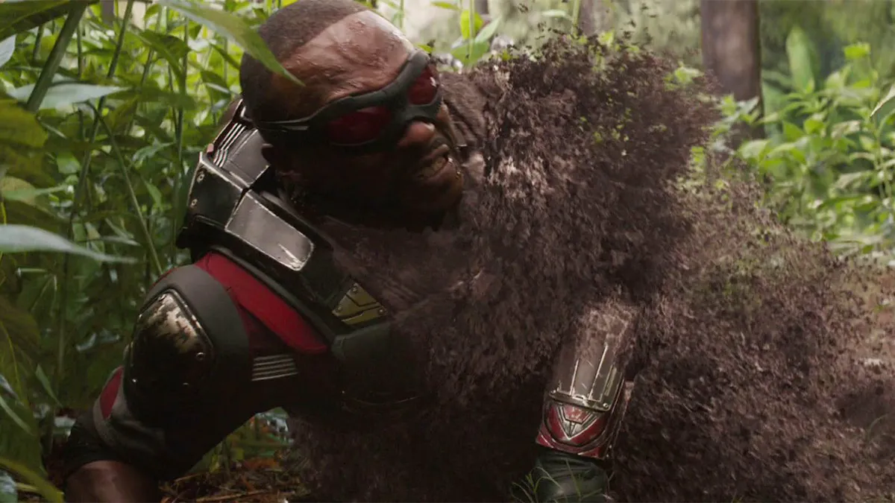
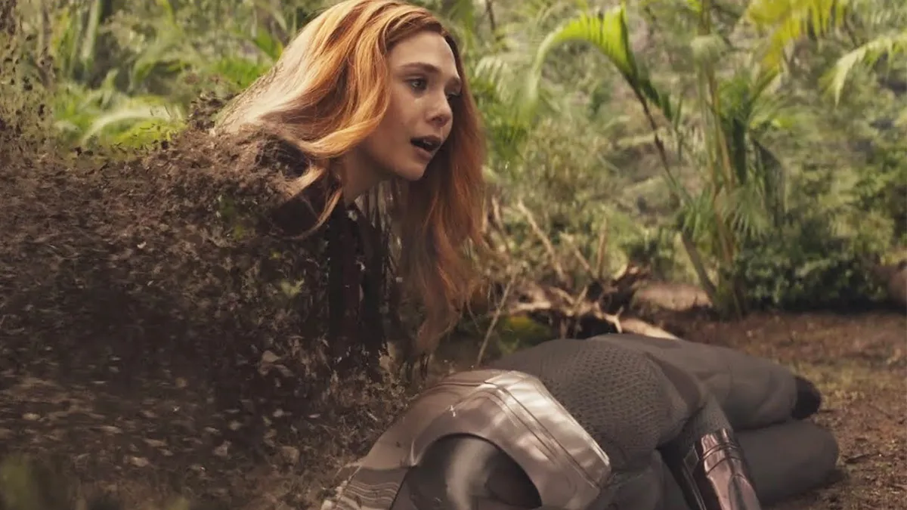
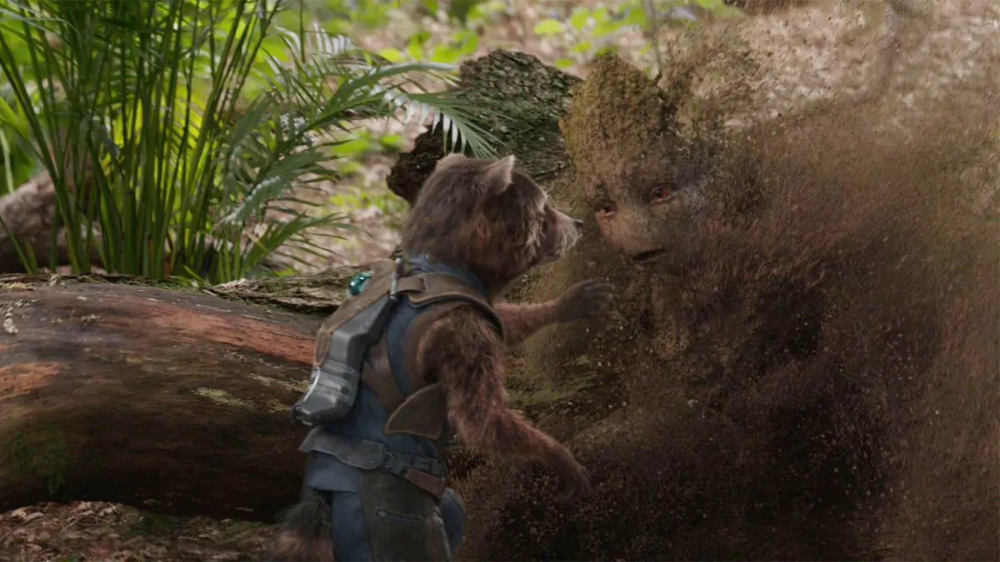
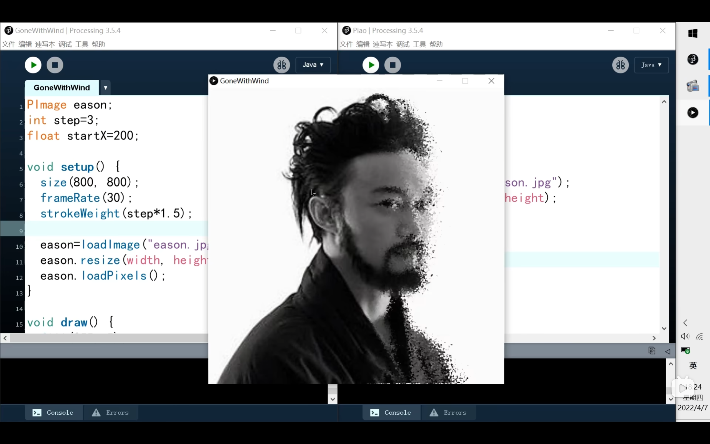
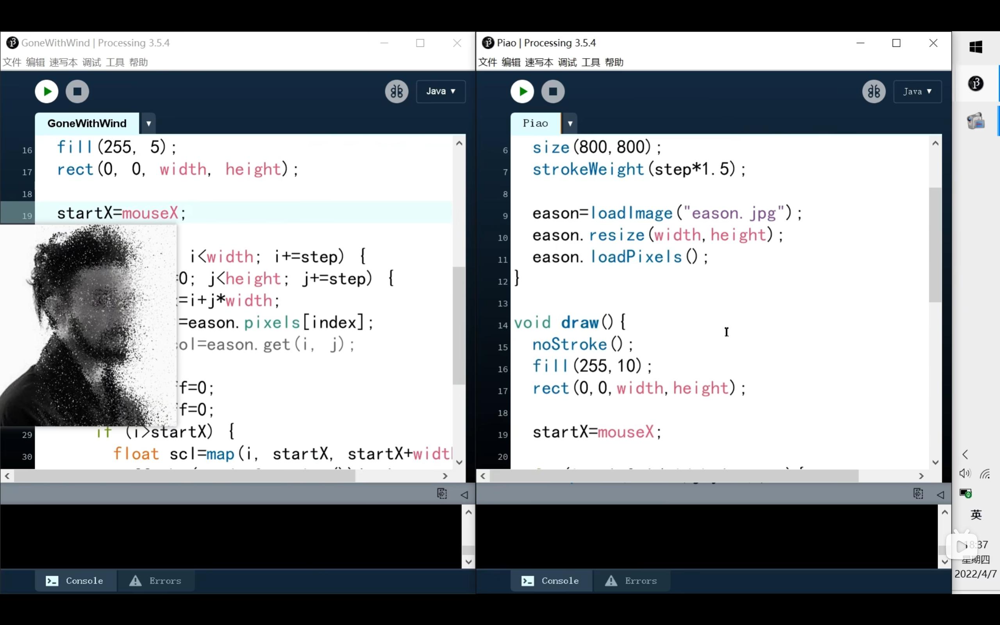

# Week8 Quiz

## Part 1: Imaging Technique Inspiration

I plan to choose the scene from *Avengers: Infinity War* where heroes disintegrate into ashes after **Thanos** snaps his fingers as my imaging technique inspiration. 

### Screenshots

### Explanation
- I choose *Avengers: Infinity War* because it's my favorite superhero movie of all time, and the scene where heroes die is profoundly impactful and memorable.
In the main assignment, I intend to modify *Saint-Georges-Majeur au crépuscule.* In the original painting, the image is split into two parts by water, and I aim to replace the water's reflection with a fragmented effect, inspired by the disintegration scene.
- This effect conveys a sense of chaos and transformation. Incorporating this effect will add a dynamic and modern twist to the painting, making it visually engaging and thought-provoking.

## Part 2: Coding Technique Exploration

I will utilize the following coding technique to achieve the disintegration effect inspired by the scene from *Avengers: Infinity War.* I will first extract the original pixel data from the image and then apply a Gaussian random method to create offsets. This process will lead to a particle-like dispersal effect, resembling the disintegration of heroes in the movie scene.

### Screenshots

### Explanation
- I have chosen to implement a Gaussian random offset technique to simulate the disintegration effect. This technique involves generating random offsets for each pixel's position in the image, causing the pixels to scatter in a manner reminiscent of particles dispersing into ashes.
- Steps to Achieve the Effect:
  1. Load the original image
  2. Extract the pixel data from the image
  3. Apply Gaussian random offsets to the pixel positions
  4. Update the image with the modified pixel positions
  5. Repeat this process over time to create an animation of the dispersal effect

### Explanation
I found a helpful tutorial on [BiliBili](https://www.bilibili.com/video/BV1au411e7Rn/?spm_id_from=333.337.search-card.all.click&vd_source=3d9c66c53e876814f790d204d2a5c4e8) that demonstrates how to use Gaussian random methods to manipulate pixel positions in an image.